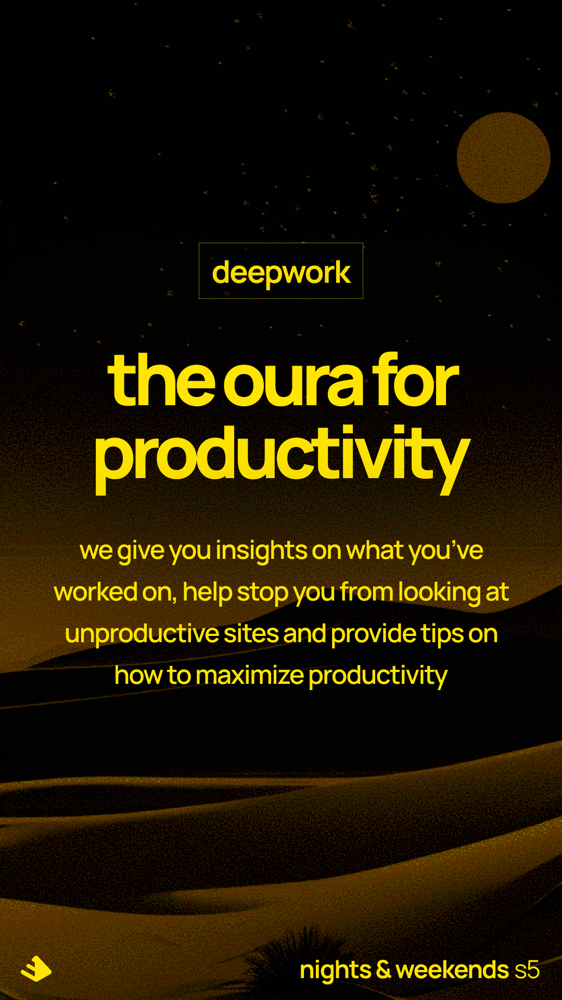

###



// TODO: VS Code extension to preview Markdown

Mission:
Building the oura for productivity. Get insights on how productive you are.

Currently, deepFocus doesn't run on weekends.

It'll send you an email at the end of everyday with the total number of deep work hours.

### Goals

Goal for the next 2 hours: build minimum viable prototype:
~~1. Allow all users to download on any machine through an Electron JS app ~~
~~2. Using JS for now, eventually will move to TS. Considering using SolidJS instead of React as well. Also, set up a CI/CD pipeline and allow users to download automatic releases. Also add a changelog using conventional commits. Application will get FULL System Access and collect logs every min to observe what the active window is.~~ 3. Allow users to enter a goal in their session.We'll ask in onboarding whether certain sites should be labeled as productive or not productive.

For the future:

1. Migrate from using electron-storage to SQL-lite/more capable database to handle more data + complex queries.

### Philosophy

For example,
WhatsApp,
Reddit
Instagram
Facebook
Gmail

^ Probably shouldn't be labeled as Deep work for most Knowledge workers and it takes away your foxus.

This product was built primarily for Software Engineers/Product/Designers in mind.

Also, there's 10,000 hours to become an expert.

Coding is the same thing. We want to face imposter syndrome & create systems > not focusing as much on TC & the end goal, but also reflecting on the journey and remind yourself that you ARE putting the work in. And if you're not,
hopefully deepFocus helps get you to do it.

Some ideas:
https://www.electronjs.org/docs/latest/tutorial/progress-bar (Progress Bar showing how much deep work done)

Note:

## Recommended IDE Setup

- [VSCode](https://code.visualstudio.com/) + [ESLint](https://marketplace.visualstudio.com/items?itemName=dbaeumer.vscode-eslint) + [Prettier](https://marketplace.visualstudio.com/items?itemName=esbenp.prettier-vscode)

## Project Setup

Note: I recommend using node LTS >=v20.12.2 & npm v10.5.0

### Install

```bash
$ pnpm install
```

### Development

```bash
$ pnpm dev
```

### Build

```bash
# For windows
$ pnpm build:win

# For macOS
$ pnpm build:mac

# For Linux
$ pnpm build:linux
```
