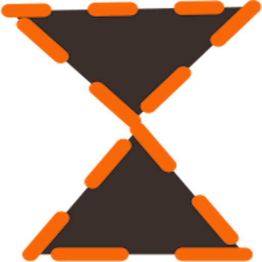

# DeepFocus

<p align="center">
  
</p>

[](https://github.com/Tech-Nest-Ventures/deepFocus/actions/workflows/release.yml)
[](https://github.com/Tech-Nest-Ventures/deepFocus/actions/workflows/integration_tests.yml)
[](https://www.npmjs.com/package/project)
[](LICENSE)

> Building the Oura for productivity. Get insights on how productive you are.

## Table of Contents

- [Features](#features)
- [Tech Stack](#tech-stack)
- [Getting Started](#getting-started)
- [Usage](#usage)
- [Goals](#goals)
- [Philosophy](#philosophy)
- [Roadmap](#roadmap)
- [Contributing](#contributing)
- [License](#license)
- [Contact](#contact)

## Features

- Daily email summaries of deep work hours
- Productivity tracking and insights
- Customizable productivity site labeling

## Tech Stack


## Getting Started

### Prerequisites

- Node.js LTS >=v20.12.2
- npm v10.5.0 or pnpm

### Installation

```bash
pnpm install
```

## Usage

Note, for running this app locally, you may run into issues with active-window. Try running `npm install --ignore-scripts` to fix this. More info [here](https://github.com/sindresorhus/active-window/issues/10).

## Goals

- [x] Allow all users to download on any machine through an Electron JS app
- [x] Migrate to TypeScript and implement SolidJS
- [x] Set up CI/CD pipeline and automatic releases
- [x] Implement changelog using conventional commits
- [x] Add integration and automated tests
- [x] Implement user authentication and cloud-based data persistence
- [ ] Allow users to enter session goals and customize productive/unproductive sites
- [ ] Migrate from electron-storage to SQLite for improved data handling

## Philosophy

DeepFocus is built primarily for Software Engineers, Product Managers, and Designers. We believe in:

- Creating systems to combat imposter syndrome
- Focusing on the journey, not just the end goal
- Encouraging consistent, focused work

## Roadmap

- Implement progress bar for deep work visualization
- Enhance data analysis and insights
- Improve user onboarding experience
- Develop comprehensive test suite for main and renderer processes
- Create cloud synchronization for user data and preferences
- Implement secure user authentication system

## Contributing

[Add contributing guidelines here]

## License

This project is licensed under the MIT License - see the [LICENSE](LICENSE) file for details.

## Contact

[Timeo Williams] - [@timeowilliams](https://twitter.com/timeowilliams) - timeo.williams@gmail.com

Project Link: [https://github.com/timeowilliams/deepFocus](https://github.com/timeowilliams/deepFocus)
